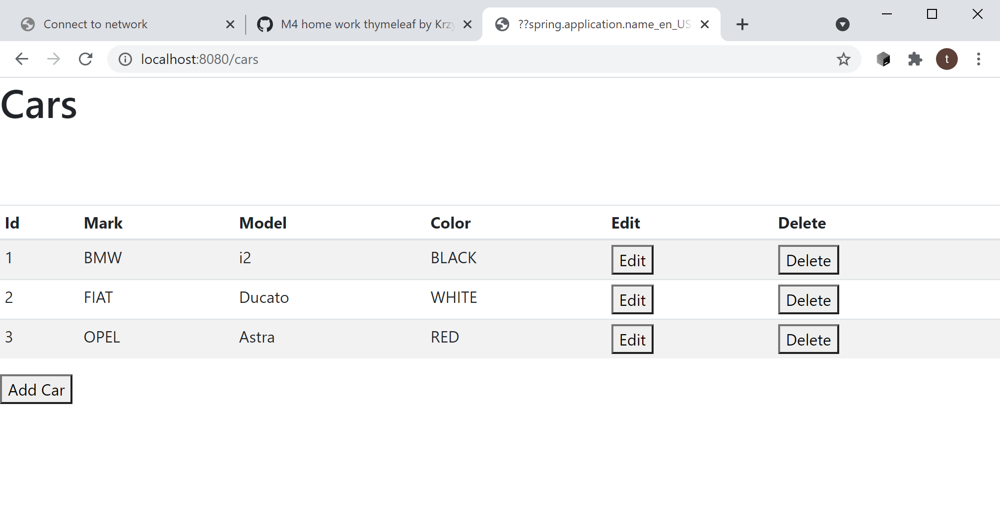

# M3_HomeWork_Car
## Zadanie podstawowe:
Napisz REST API dla listy pojazdów. 

- [x] Pojazd będzie miał pola: id, mark, model, color.

### API które będzie obsługiwało metody webowe:
- [x] do pobierania wszystkich pozycji
- [x] do pobierania elementu po jego id
- [x] do pobierania elementów w określonym kolorze (query)
- [x] do dodawania pozycji
- [x] do modyfikowania pozycji
- [x] do modyfikowania jednego z pól pozycji
- [x] do usuwania jeden pozycji
- [x] Przy starcie aplikacji mają dodawać się 3 pozycje.

—————————

## Dla ambitnych:

- [x] rozbuduj aplikacje o możliwość zwracania danych w postaci XML
- [x] dodaj obsługę Swgger UI
- [ ] zaimplementuj HATEOAS

## Dodatkowo
- [x] walidacja danych wejściowych

# M4_HomeWork_Thymeleaf
Rozbuduj swoją aplikacje z poprzedniego tygodnia o interfejs graficzny, który umożliwi:

- [x] wyświetlanie wszystkich pozycji
- [x] pobieranie elementu po jego id
- [x] dodawanie pozycji
- [x] modyfikowanie pozycji
- [x] modyfikowanie jednego z pól pozycji
- [x] usuwania jednej pozycji

